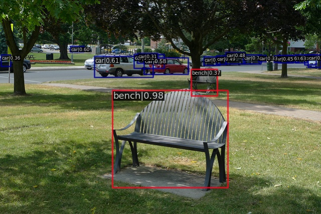

# 学习简报
2022.08.22-2022.08.27
<!-- more -->

## 本周完成
1. 对swin transerfer 的docker环境的搭建
2. 完成开学报道等多项事宜

## 学习进度报告
1. 本周的重点内容在于环境的重新配置，因为某些我不知道的原因，我从家中主机拆下的固态硬盘装到新笔记本上后，archlinux出现了各种各样的bug，这迫使我重新安装了操作系统，并对cuda环境进行重新配置。最后我选择使用docker来对机器学习的环境进行重新配置，我选择了pytorch1.11.0-cuda11.3-cudnn8-devel。在重新配置完环境后，试运行得到如图结果。
<!--  -->

1. 本周在赵琦师兄的帮助下成功的启动了原先的大相机，把大相机的环境重新检查了一边，接着继续进行视频流的对接工作，目前正在调试中。

2. 前往D4和南科大进行报道

## 下周计划
1. 完成视频流和神经网络的对接工作
2. 尝试使用mmdection 构建swin transformer

## 问题和反馈
在配置环境的过程中走了很多弯路，直到最后才想起docker内也是可以进行对gpu的训练的。浪费了较多时间。
